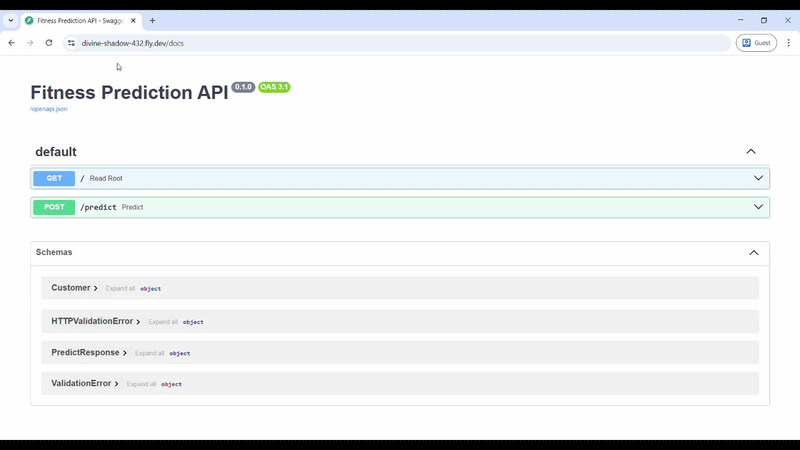

# 🏋️ Fitness Classification Project

## 📋 Problem Description

This project addresses a **Binary classification problem** using a synthetic dataset that simulates real-world fitness assessment. 
The goal is to predict whether a person is **fit** (`is_fit = 1`) or **not fit** (`is_fit = 0`) based on various health and lifestyle features.

### 📊 Dataset Overview
- **📈 Samples**: 2,000 individuals
- **🎯 Features**: 10 predictive features + 1 target variable
- **⚖️ Target Distribution**: ~60% not fit (0), ~40% fit (1)
- **🚨 Data Challenges**: 
  - 🔀 Mixed data types (numerical and categorical)
  - ❓ Missing values (~8% in sleep_hours)
  - 🔠 Inconsistent formatting (mixed numeric/string values)
  - 📊 Outliers present in weight_kg (~2% of samples)
  - 🔗 Complex feature relationships with target

### 🗂️ Features
| Feature | Description | Type |
|---------|-------------|------|
| `age` | Age in years | Integer |
| `height_cm` | Height in centimeters | Integer |
| `weight_kg` | Weight in kilograms (contains outliers) | Integer |
| `heart_rate` | Resting heart rate in BPM | Float |
| `blood_pressure` | Systolic blood pressure in mmHg | Float |
| `sleep_hours` | Average daily sleep hours (contains NaNs) | Float |
| `nutrition_quality` | Daily nutrition score 0-10 | Float |
| `activity_index` | Physical activity level 1-5 | Float |
| `smokes` | Smoking status (mixed types) | Mixed |
| `gender` | Gender ('M' or 'F') | String |
| `is_fit` | **Target variable** (1=fit, 0=not fit) | Binary |

## 🔧 Methodology

### 🧹 Data Preprocessing

1. **🔄 Handled Mixed Data Types**:
   - ✅ Converted 'smokes' column to consistent binary format (0/1)
   - ✅ Created 'is_male' feature from gender column (0/1 encoding)

2. **🎯 Missing Value Treatment**:
   - ✅ Imputed missing 'sleep_hours' values with median from training set to avoid Data Leakage

3. **📏 Feature Scaling**:
   - ✅ Standardized numerical features for logistic regression model, Tree based models do not require scaling - hence used a copy of same dataset.

4. **🔍 Exploratory Data Analysis**:
   - ✅ Generated histograms and boxplots to understand data distribution
   - ✅ Analyzed feature relationships and outlier patterns

### 🤖 Model Development

Four classification models were trained and evaluated:

| Model | Type | Purpose |
|-------|------|---------|
| **Logistic Regression** | Linear | Baseline performance |
| **Random Forest** | Ensemble | Handle non-linearity |
| **XGBoost** | Gradient Boosting | State-of-art performance |
| **Decision Tree** | Tree-based | Interpretability |

## 📊 Model Performance

### 🏆 Validation ROC-AUC Scores

| Model | 🥇 ROC-AUC Score | Rank | Status |
|-------|-----------------|------|---------|
| **Logistic Regression** | **0.8566** | 1 | 🥇 **Best Model** |
| Random Forest | 0.8417 | 2 | 🥈 |
| XGBoost | 0.8400 | 3 | 🥉 |
| Decision Tree | 0.7999 | 4 | |

### ⚙️ Hyperparameter Tuning
- 🔧 Performed hyperparameter optimization on training set
- 📋 Validated performance on separate validation set
- 🎯 Logistic Regression demonstrated superior performance

## 🚀 Deployment

### 🌐 Production Setup
- **🎯 Final Model**: Logistic Regression trained on full training dataset
- **☁️ Deployment Platform**: Fly.io
- **🖥️ Application Type**: Binary classification web service
- **🎥 Project Deployment Demo**: Includes demonstration video
      

## 💡 Key Findings

- ✅ **Logistic regression achieved the best performance** despite dataset complexity
- ✅ **Proper data preprocessing** was crucial for model success
- ✅ **Feature scaling** significantly improved linear model performance
- ✅ The synthetic dataset effectively mimics **real-world data challenges**

## 🎯 Usage

The deployed model can be used to predict fitness levels based on health and lifestyle parameters, making it suitable for:

- 🏥 Health assessment applications
- 💪 Wellness programs
---

> **Note**: This dataset is synthetic and intended for **educational purposes** to practice data cleaning, feature engineering, and classification modeling.

**❤️  Deployed Video ☁️ Fly.io**
